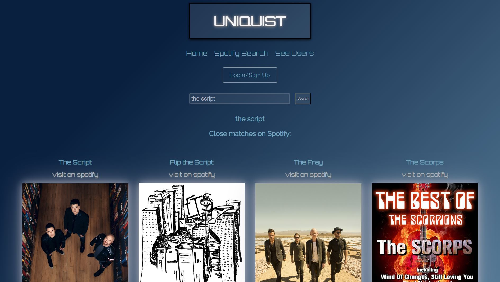
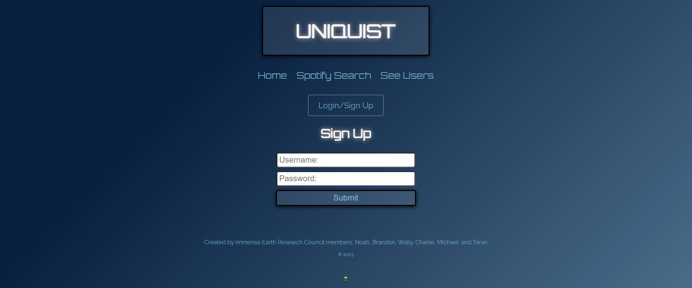

# UNIQIST

## URL

https://www.uniqist.net

## Description

This project is where a musical artist can choose a fitting unique band name so that they can express their band's style. The musical artist can manage their bands, band names, and people they follow after signing up. The musical artist can find potential band names and save them to their profile. The musical artist can follow other people and see their profiles. The musical artist can create new bands and add others to the band. The musical artist can search for other musical artists from Spotify.

## Usage

## Credits

Noah Nielsen, Brandon Baird, Taran Leu, Wally Light, Charlie Garvin, & Michael Nguyen

## License

Please refer to the LICENSE in the repo.
